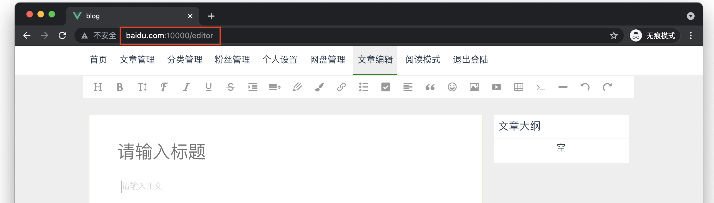

> 一个简单的DNS服务器，适合学习和扩展



## 背景

1. 使用多个操作系统，并且经常改host文件，各个系统修改方式不一样，尤其是Windows经常遇见权限问题
2. 方便项目部署测试
3. 学习！学习！！学习！！！

## 如何使用？

1. 下载或克隆本项目
2. 运行`DnsStarter`的main方法
3. 在路由器上或者你的电脑配置DNS即可

## 注意事项

1. 第一个DNS必须是本项目的IP，另外，需要指定第2个DNS IP才能解析其他域名（可以选择本地网关IP）。

## 如何更新自定义的域名规则？

域名映射规则的配置文件名为`dnshost.config`，你可以将它放置在桌面或者桌面同级目录下的任意一个地方，比如"文档"文件夹下。然后，访问域名：`dns.weidaa.com`即可，你不会看到有任何反应，但是域名规则已经更新了。

`dnshost.config`是json格式的文件，格式如下：

```json
[
  {
    "name": "blog.weidaa.com",
    "type": 4,
    "ip": "192.168.1.4"
  },
  {
    "name": "baidu.com",
    "type": 4,
    "ip": "192.168.1.4"
  }
]
```

其中，

name: 域名

type: 当前支持 4 和 6 两个值，表示ipv4 或者 ipv6

ip: 地址

## 学习DNS？

> 建议！仅供参考

1. 为了了解：看看基本概念，着重看递归、迭代查询
2. 为了深入：看看 DNS 协议，着重了解返回码（ReturnCode）部分
3. 为了写一个server：位运算，类型转换（重点），DNS 报文格式
